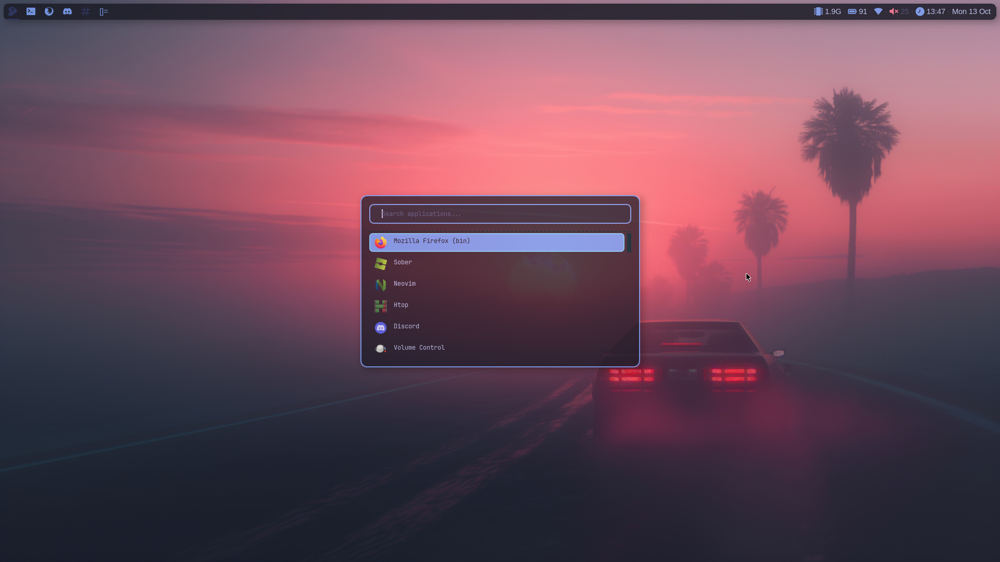
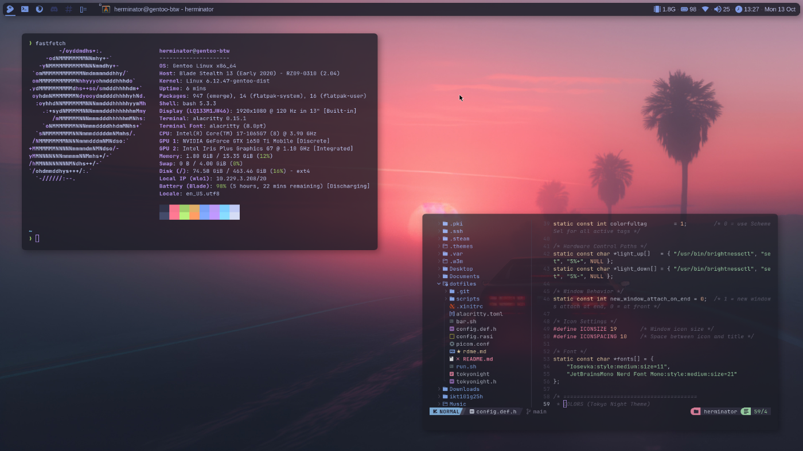
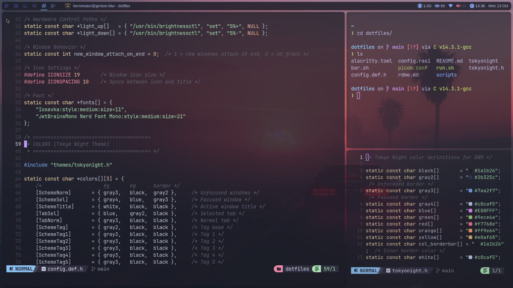

# iGotUsername's ChadWM Dotfiles

A clean, minimalist ChadWM configuration featuring the Tokyo Night colorscheme, custom status bar, and smooth window animations.

> [!NOTE]
> These are my personal dotfiles - built for me, shared for anyone who finds them useful.

## Screenshots






## Features

*   Tokyo Night colorscheme across all components
*   Custom status bar - RAM · Battery · WiFi · Volume · Time · Date (dash-based, minimal overhead)
*   Picom compositor - Smooth animations, rounded corners, and elegant shadows
*   Rofi launcher - Fast application menu with matching theme
*   Alacritty terminal - GPU-accelerated with transparency support
*   Hardware keys - Brightness and volume controls (laptop-friendly)
*   Screenshot utilities - Fullscreen and selection capture to clipboard
*   5 workspaces - Clean layout with minimal gaps


## Prerequisites

ChadWM must be installed first - Follow the official installation guide: https://github.com/siduck/chadwm#setup


## Core Components

*   chadwm
*   alacritty
*   rofi
*   picom
*   dash


## System Utilities

*   brightnessctl (Brightness control)
*   maim (Screenshot capture)
*   xclip (Clipboard management)
*   wireplumber (Audio control via wpctl)
*   xsetroot (Status bar rendering)


## Fonts

ttf-jetbrains-mono-nerd


## Installation

> [!WARNING]
> You should backup your existing configs before proceeding! The deployment script will overwrite files without confirmation.

1.  Clone the repository
    ```bash
    git clone https://github.com/iGotUsername/dotfiles ~/dotfiles
    ```

2.  Navigate to directory
    ```bash
    cd ~/dotfiles
    ```

3.  Make scripts executable
    ```bash
    chmod +x scripts/*
    ```

4.  Deploy dotfiles to your system (or do manually)
    ```bash
    ./scripts/push
    ```

5.  Recompile ChadWM
    ```bash
    cd ~/.config/chadwm
    ```


## Usage

Push files:
Push configs from ~/dotfiles directory into your system configuration files: ./scrips/push

Pull files:
Pull your current system configuration files into your ~/dotfiles directory: ./scripts/pull

> [!NOTE]
> Running the *pull* script will overwrite all the configuration files in your ~/dotfiles directory

## File Structure

    ~/dotfiles/
    ├── scripts/
    │ ├── push (Deploy dotfiles to system)
    │ └── pull (Backup system to dotfiles)
    ├── config.def.h (DWM window manager configuration)
    ├── picom.conf (Compositor settings - animations, shadows)
    ├── alacritty.toml (Terminal emulator config)
    ├── config.rasi (Rofi launcher theme)
    ├── bar.sh (Status bar script)
    ├── run.sh (DWM startup script)
    ├── tokyonight.h (DWM color definitions)
    └── tokyonight (Status bar colors)


## Keybindings

Should be the same as ChadWM. If not, take a look in config.def.h to edit or remember.


## Troubleshooting

**Scripts don't work?**
1.  Ensure paths in scripts/push and scripts/pull match your file structure
2.  Check script permissions: chmod +x scripts/*


**Status bar not showing?**
1.  Verify dash is installed: which dash
2.  Check bar.sh has execute permissions
3.  Ensure required utilities are installed (see Dependencies)

**Picom animations laggy?**
1.  Your GPU may not support the features. Maybe try another backend in picom.conf
2.  Disable animations: comment out animations = true; 


**Incompatibility issues?**
1.  These dotfiles are tailored to my specific setup. Adjustments may be needed for different systems or ChadWM versions.


## Credits

*   ChadWM: Based on siduck's chadwm (https://github.com/siduck/chadwm)

*   Tokyo Night Theme: Color scheme by enkia (https://github.com/enkia/tokyo-night-vscode-theme)

*   Documentation: README structure created with assistance from AI

*   Code: Some portions has been generated with AI assistance, then reviewed, tested, and validated by me

*   Community: Inspiration from countless dotfiles repos and, of cource r/unixporn

**If you recognize uncredited work, please open an issue so I can properly attribute it.**


## License

*MIT License - Feel free to use and modify as you wish.*
